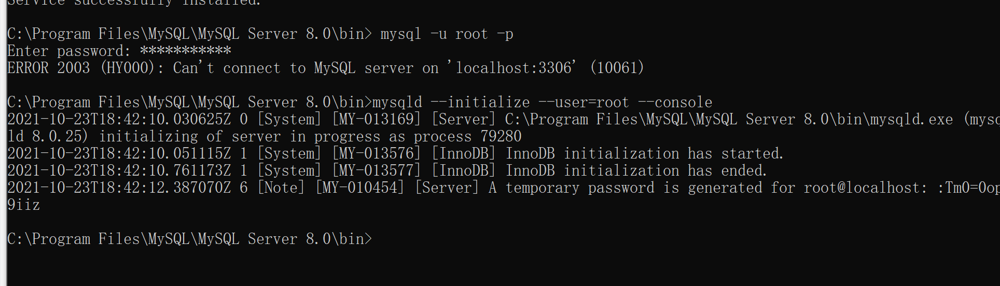
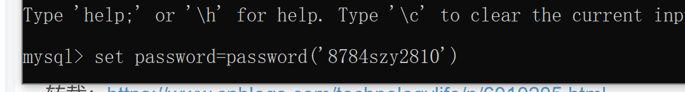

# 《天天果园》——Java项目

---

## 001 项目简介

## 003 数据库设计

### 1. 用户表

| 字段  |     类型     | 主键 | 约束 |  备注  |
| :---: | :----------: | :--: | :--: | :----: |
|  id   |     int      |  √   | 自增 |  序号  |
| email | varchar(255) |  ×   |      |  邮箱  |
| phone | varchar(255) |  ×   |      |  电话  |
|  pwd  | varchar(255) |  ×   |      |  密码  |
| uname | varchar(255) |  ×   |      | 用户名 |

### 2. 水果表

| 字段  |     类型     | 主键 | 约束 |   备注   |
| :---: | :----------: | :--: | :--: | :------: |
|  fid  |     int      |  √   | 自增 |   序号   |
| fname | varchar(255) |  ×   |      |  水果名  |
| spec  | varchar(255) |  ×   |      |   规格   |
| price |    double    |  ×   |      |   价格   |
| intro |   longtext   |  ×   |      |   简介   |
|  tip  |   longtext   |  ×   |      | 温馨提示 |
| pnum  |     int      |  ×   |      | 图片数量 |

### 3. 热卖水果表

| 字段 | 类型 | 主键 | 约束 | 备注 |
| :--: | :--: | :--: | :--: | :--: |
| fid  | int  |  √   | 自增 | 序号 |

### 4. 购物车表

|  字段  | 类型 | 主键 | 约束 |       备注       |
| :----: | :--: | :--: | :--: | :--------------: |
|  uid   | int  |  √   | 自增 |      用户id      |
|  fid   | int  |      |      |      水果id      |
| isStar | int  |      |      |     是否关注     |
| isCart | int  |      |      | 是否添加到购物车 |

:Tm0=0op9iiz

set password=password('8784szy2810');

mysql> set password for root@localhost = password(‘8784szy2810’);